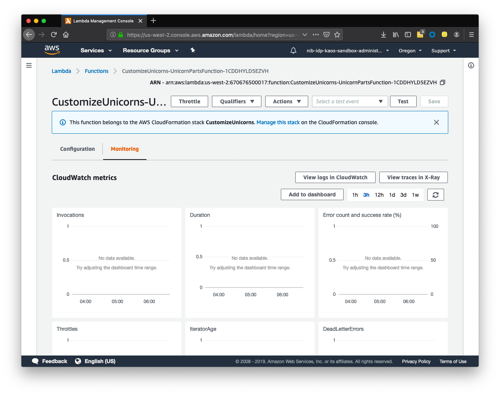

# Appendix A: Troubleshooting

This page provides some directions for troubleshooting.

## General Troubleshooting - Finding your logs

If you're getting errors when calling your lambda from Postman check out the logs!

The easiest way to find your logs is

1. navigate to Lambda,

1. open your Unicorn Service,

1. click `Monitoring`

	

## Error access denied

Assuming you have successfully completed all of Module 1 and had the API working from Postman it's likely your authentication token has simply hit the 1 hour timeout.

Try getting a new auth token following the same instructions as in [01 add authentication module 1f](./blob/niblify/docs/01-add-authentication#module-1f-use-the-partner-company-client-credentials-to-customize-unicorns)

## Unable to read index

This is typically if you haven't updated the dbUtils.js with the Aurora connection string, see [00 initial setup module 0d](./blob/niblify/docs/00-initial-setup#module-0d-run-your-serverless-application-locally-with-sam-local)
